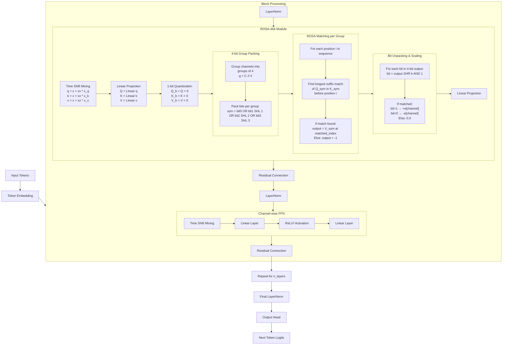

# RWKV-8 ROSA: Beyond Attention

**Date:** October 11, 2025 | Updated: January 20, 2026

---

## Introduction
This document details the **RWKV-8 ROSA** mechanism, a novel neurosymbolic approach designed to replace traditional attention mechanisms in neural networks. **ROSA (Rapid Online Suffix Automaton)** enables infinite-range, lossless information propagation by efficiently processing discrete token sequences.

---

## Core Principle
Given a token sequence \( x = x_0x_1 \dots x_{n-1} \), ROSA computes a new sequence \( y = y_0y_1 \dots y_{n-1} \) using suffix automata logic. For each position \( i \), the output \( y_i \) is defined as:

\[
y_i=\begin{cases}
x_{j+1}, & \text{if there exists } j < i \text{ and } m \geq 0 \text{ s.t. } x_{j-m:j}=x_{i-m:i}\\
-1, & \text{otherwise}
\end{cases}
\]

Here, \( j \) is chosen to maximize the matching length \( m \), with ties broken by selecting the largest \( j \).

The algorithm iterates through tokens, maintaining state transitions to track contextual dependencies. It features adaptive time complexity, typically \( O(n) \) but \( O(n^2) \) in the worst case.

---

## Performance & Applications
- **Prediction Accuracy**: ROSA's error rate decreases as context length increases, outperforming naive baselines on long-document tasks (tested on 10,000+ token sequences from "The Pile").
- **Practical Use Cases**:
  - Integrate \( \text{Emb}(\text{ROSA}(x)) \) into LLM layers (especially early ones) for enhanced contextual understanding. This method is also valid for kNN+LLM and useful for RAG.
  - Employ neurosymbolic integration: Add \( \text{Emb}(\text{ROSA}(\text{Sampling}(z_a))) \) to tensor \( z_b \) (e.g., in the next layer). This allows the LLM+ROSA to invent its own inner monologue languages. Each LLM layer can produce multiple sequences with small vocabularies for fast parallel ROSA processing.
  - Enable dynamic token bookmarking (e.g., `<C_begin><C_3><C_6><C_end>`) to mark the start of a specific chat round, allowing ROSA to perfectly retrieve any chat history. This supports speculative decoding for speedup and can be managed end-to-end by the LLM.

---

## Advantages Over Attention
ROSA operates directly on discrete tokens, avoiding computationally expensive operations like dot products and softmax. This design eliminates the need for a KV cache, significantly reducing memory overhead and enabling real-time, scalable inference on both CPU and GPU architectures.

---

## ROSA Variants
Several architectural variants of the ROSA mechanism have been explored, offering different trade-offs in simplicity, memory, and performance.

### 1. **ROSA-QKV-1bit**
This is currently the best overall design. It quantizes the standard Q/K/V float tensors to 1 bit (e.g., values > 0 map to 1, ≤ 0 map to 0). The ROSA algorithm matches each 1-bit query sequence \( Q_i \) within its corresponding key sequence \( K_i \). The output value is taken from the 1-bit \( V_i \) at the matched position (or set to 0 if unmatched). Finally, a trainable per-channel vector \( e_i \) scales the binary output (1 → \( e_i \), 0 → \( -e_i \)). This 1-bit quantization enables very efficient gradient computation and learning.

### 2. **ROSA-QKV-floatV**
An intuitive extension is to use a full-precision (float) value tensor \( V \) and remove the scaling vector \( e_i \). However, initial experiments surprisingly show worse performance. This may be because the specific gradient computation methods developed for the 1-bit variant, combined with learning \( e_i \) and a binary \( V \), are more effective than learning a continuous \( V_{float} \).

### 3. **ROSA-QKV-lite**
An extremely simple discrete memory system. It uses a larger vocabulary and simply matches the last occurrence of a query token \( Q \) in the key sequence \( K \). This is equivalent to limiting the ROSA matching length to 1, prioritizing speed and simplicity over contextual depth.

### 4. **ROSA-QKV-NNS**
This variant departs from exact ROSA matching. It uses full-precision Q/K vectors and performs a nearest-neighbor search (e.g., using a k-d tree for speed) to find the closest key for each query, acting like a top-1 attention mechanism. This could be promising for improving long-context performance in RNNs, as it maintains a small, efficient KV cache that can be computed on a CPU.

### 5. **ROSA-RePo**
Inspired by methods like [RePo](https://pub.sakana.ai/repo/), this explores reordering ROSA tokens for efficiency. The primary challenge lies in computing gradients efficiently through this reordering operation.

### 6. **ROSA-4bit Language Model Implementation**
The provided code implements a production-ready **4-bit ROSA language model** within the RWKV-8 architecture ("Heron"). This design strikes a balance between the efficiency of 1-bit quantization and representational capacity.

**Core Mechanism (`rosa_slow_4bit_layer`):**
*   **Grouping:** The model channels (C) are grouped into blocks of 4 (or more generally, `bits`). For each group `g`, a 4-bit symbol is constructed per timestep by packing the 1-bit values from its constituent channels.
*   **Matching:** The ROSA algorithm operates on these sequences of 4-bit symbols. It matches the query symbol sequence \( Q_{sym} \) against the key symbol sequence \( K_{sym} \) to find the longest suffix match.
*   **Output:** For a matched position, the corresponding 4-bit value symbol \( V_{sym}[matched\_index] \) is retrieved. This symbol is unpacked, and each bit controls the output for its corresponding channel: `bit=1` outputs `+e[channel]`, `bit=0` outputs `-e[channel]`. Unmatched positions output `0.0`.
*   **Integration:** The `RWKV_ROSA_4bit` module integrates this layer into a standard Q/K/V projection setup with time-shift mixing, similar to other RWKV components.

**Model Architecture:**
The model follows a standard pre-normalization Transformer-style block:
1.  **LayerNorm:** Applied to the input.
2.  **ROSA-4bit Attention:** The core `RWKV_ROSA_4bit` module replaces the standard attention mechanism.
3.  **Channel-wise FFN (`RWKV_CMix_x070`):** A feed-forward network with ReLU² activation, applied after another LayerNorm.
4.  Residual connections are added around both the ROSA and FFN sub-blocks.

**Architecture Flowchart**

---

## Conclusion
RWKV-8 ROSA bridges symbolic and neural paradigms, offering a parameter-free, neurosymbolic solution for next-token prediction and beyond. Its efficiency, adaptability, and lossless information propagation position it as a robust alternative to attention mechanisms in modern AI workflows. The ongoing exploration of variants (1-bit, 4-bit, NNS, etc.) and its successful integration into a full language model underscore its versatility and potential for efficient, long-context reasoning.
